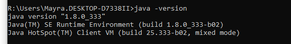
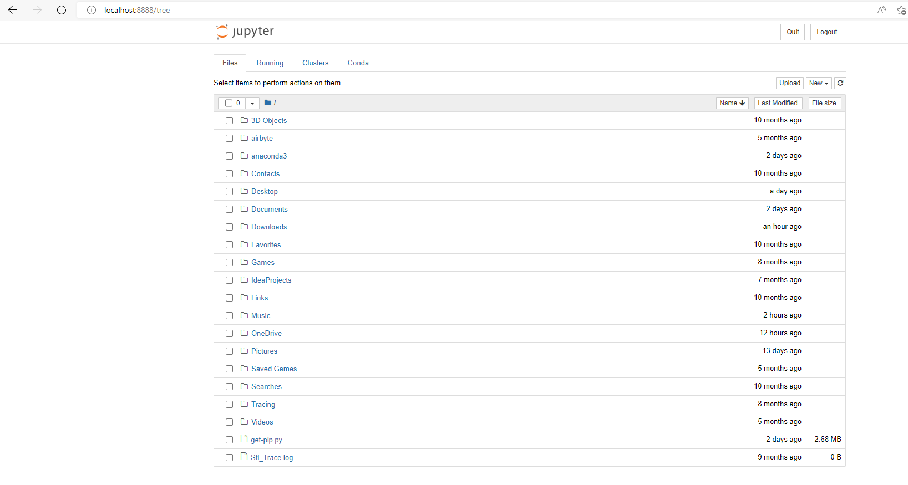
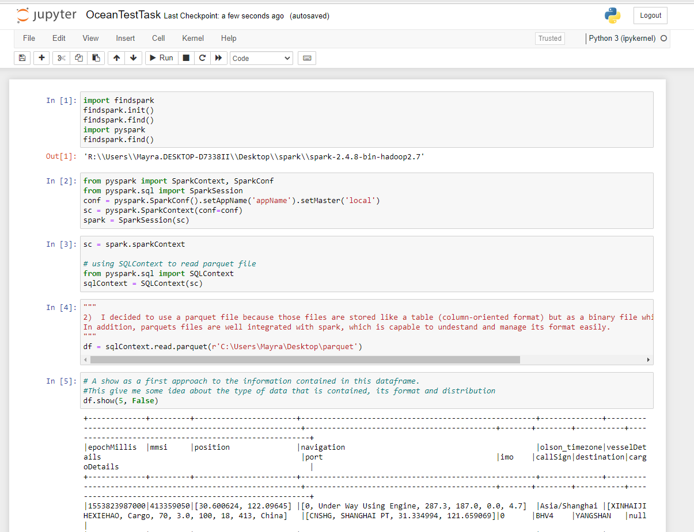
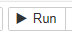

# Ocean Test Task

This code was constructed using python3.6 and spark 2.4.7, as pyspark code. The following instructions will help you to create and environment that supports those technologies and also to identify how to execute the code.

Prerequisites:

- [Java](#java) 
- [Anaconda/Python](#anacondapython) 
- [Apache Spark](#apache-spark)
- [Jupyter](#jupyter) 

Once you have configured the prerequisites you can review the [Task Execution Instructions](#task-execution-instructions) where you can find the instructions about how to execute the pyspark code cell by cell using jupyter notebook.

### Java:

To validate If java is already install, open a Command prompt and type the following command

```bash
java -version
```

if you do not have it the following message will be shown:

```bash
'java' is not recognized as an internal or external command, operable program or batch file.
```

If you have it already install, when you execute the version command you will see something like that:



### Anaconda/Python:

Anaconda is a very useful tool, to work with python and I recommend this one , which is not strictly necessary but nice to have. 

To validate if you have python installed does not matter if it is with anaconda or not, you should execute the following in the Command prompt:

```bash
python --version
```

If you do not have python installed properly an error message like the following will be shown :

```bash
'python' is not recognized as an internal or external command, operable program or batch file.
```

Please validate the version displayed because a Python 3.6 version or smaller is required because this is the last version supported by Spark 2.4 (The spark version used for the development of this task). 

If you have a higher version of Python, a python environment can be created to maintain the version that you already have and additionally have this new one. The command to create that environment for Python 3.6 in anaconda is:

```bash
conda create -n myenv python=3.6
```

The version can be downgraded if necessary.

Once you have the environment created, you can activate it using:

```bash
conda activate myenv
```

### Apache Spark:

This task was developed using Spark2.4.8 version, but in the spark site only Spark3 Version are being promoted as you can see here: https://spark.apache.org/downloads.html. For that reason, we should go to this repository https://archive.apache.org/dist/spark/ that contains all the previous spark versions and search for a file that looks like this one:

```
spark-2.X.X-bin-hadoop2.7.tgz   
```

Which indicates the spark version and contains the Hadoop bin. 

The ones which finish with .asc or .sha512 are to validate the integrity of the download but are not the dist. (If you want to do that validation, You should download two files, the one that ends with .tgz and the one that ends with the extension of the encryption technology that you want to use).

Extract the files from the downloaded .tgz. The extracted files, must be located in a folder directory that does not have any blank space in its route.

Two environment variables must be created:

 **SPARK_HOME**: The folder directory where you have the extracted files.

**HADOOP_HOME** : The route to the haddop folder that is inside the SPARK_HOME directory.

#### winutils:

if you are using windows, the use of winutils is required. For that you could go to the github repository of winutils (https://github.com/steveloughran/winutils) and search for the Apache Spark Version that you installed.

paste the .exe file in a haddop/bin folder inside SPARK_HOME folder.

### Jupyter:

To install jupyter open an Anaconda Prompt and type:

```bash
python -m pip install findspark
```

Just wait for the installation and that is it.


Once this command finish its execution. Type:

```python
jupyter notebook
```


### Task Execution Instructions:

If all the technologies mentioned before are installed properly.

Go to a prompt that can reach all your configurations (In my case a command prompt with my conda environment activated to access the 3.6 python version) and type:

```python
jupyter notebook
```

once the jupyter notebook is launched, it will open the server interface which is available in `localhost:8888`



Search in the interface for the folder that contains the task `.ipynb` file and once you find it click on it to open. The code will appear in the screen in a readable format



##### Execute the code:

There are multiple ways to execute a code in a jupyter notebook, for example:

- Place your mouse over the cell that you want to execute, click on it and press  `ctrl+enter`
- Place your mouse over the cell that you want to execute, click on it and in the tool bar click the run button 
- Click the tool bar button  to restart the kernel and run all cells